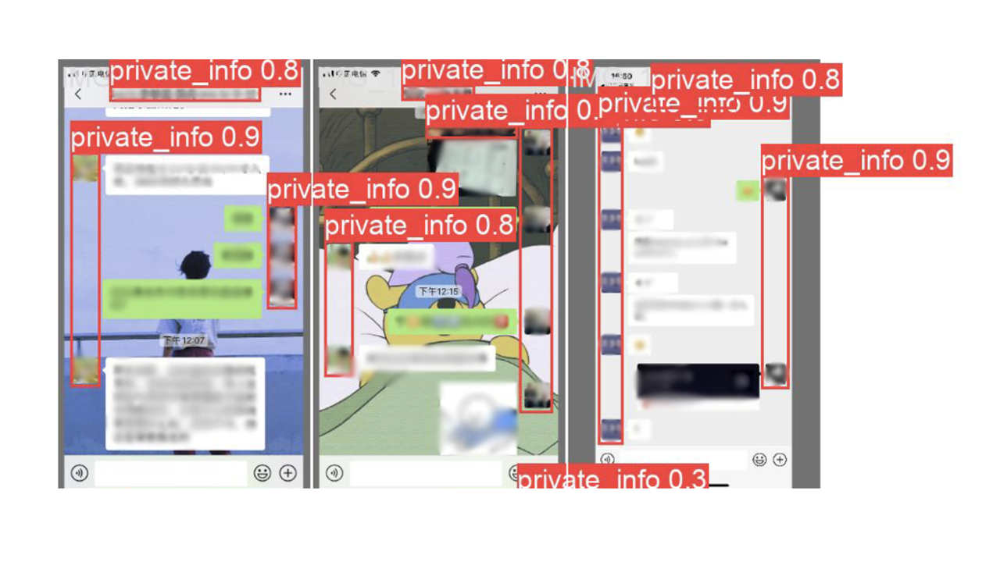

---

    

  

## Project Overview
This project aims to protect digital privacy by using a deep learning model, **YOLOv8n**, to detect sensitive information in WeChat screenshots. The model addresses privacy concerns by automatically identifying and allowing anonymization of personal details, enhancing security in digital media sharing.

## Introduction
With the rise of digital communication, inadvertent sharing of personal information, especially through screenshots, poses privacy risks. This project focuses on adapting **YOLOv8n**—a real-time object detection framework—to recognize sensitive elements like usernames and profile pictures in WeChat screenshots.

## Methodology
### Model Selection
We trained the **YOLOv8n** model, optimized for real-time processing, over 80 epochs on 130 manually annotated WeChat screenshots. The model effectively detects sensitive data using techniques like bounding boxes for personal information such as usernames and photos.

### Training Process
- **Loss Functions**: We used a combination of Box Loss, Classification Loss, and Distribution Focal Loss to optimize the model's performance.
- **Evaluation Metrics**: Performance was measured using precision, recall, and the mean average precision (mAP) to ensure high detection accuracy. The final precision achieved was **96.8%**.

### Challenges
- Manual data annotation was time-consuming and impacted the model's ability to generalize to unseen data.
- Detecting sensitive information in complex WeChat layouts, especially densely packed text, posed additional challenges.

## Results
After training, the model was evaluated on 12 test images, achieving a high precision of **96.8%** and mAP50 of **95.2%**. While performance was strong in clear scenarios, more ambiguous cases (e.g., overlapping text) require further optimization.

## Future Directions
Future improvements include:
- Expanding the dataset to cover more diverse scenarios.
- Integrating the model into a real-time system for automatic privacy protection in image sharing.

## Conclusion
This project demonstrates the potential of **YOLOv8n** in enhancing privacy during digital communications by effectively detecting personal information in WeChat screenshots. While the initial results are promising, further work is needed to improve the model’s accuracy in complex environments and integrate it into a practical tool for everyday use.

---

##### Related material

+ [Full report](report.pdf)
+ [Presentation slides](slides.pdf)
