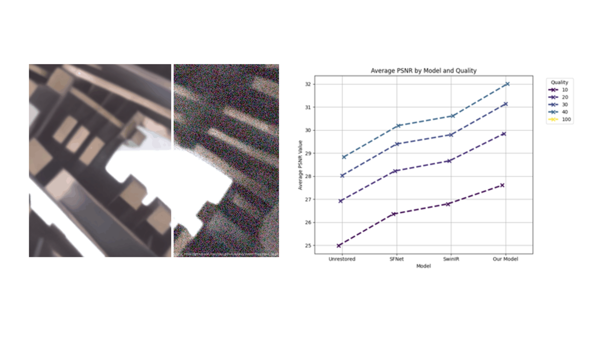

---
**Collaborative Project**  

    

### Project Overview
This project presents a deep learning method to enhance compressed images specifically for machine learning tasks, addressing the performance degradation caused by image distortions such as blurring and blocking. The approach combines an image restoration network and a classification network to optimize compressed image quality for machine consumption.

### Motivation
While most existing methods focus on improving the visual quality of compressed images for human viewers, these techniques fail to optimize the images for machine learning models. Compressed images can negatively impact model performance, especially in tasks like object detection and image classification.

### Proposed Method
We developed a joint restoration-classification network that enhances compressed images while simultaneously improving classification accuracy. The network utilizes SwinIR for image restoration and EfficientNet-B0 for classification. The optimization process balances image quality metrics (PSNR, SSIM) and classification accuracy using a combination of Charbonnier and cross-entropy losses.

### Key Results
- The proposed method improved top-1 classification accuracy by 6.2% for JPEG compressed images at quality level 40 and by 12.2% at quality level 10.
- The restored images consistently outperformed both pre-existing methods and compressed images across various quality levels in terms of PSNR, SSIM, and classification accuracy.

### Conclusion
This novel approach bridges the gap between image quality restoration and machine learning task performance. The joint network enhances compressed images specifically for machine consumption, ensuring that machine learning models perform effectively even with distorted input images.

---

##### Related material

+ Full report (available upon request)
+ Presentation slides (available upon request)