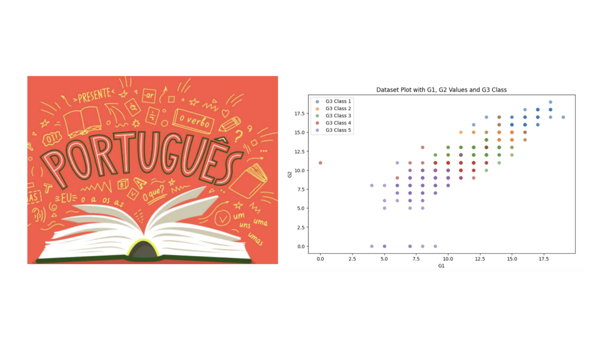

**Collaborative Project**

    

## Project Overview

In this project, we explored the potential of machine learning to predict secondary school students' final exam performance, using data from two public schools in Portugal's Alentejo region. The goal was to determine how well students' Portuguese Language grades could be forecasted by examining their study habits, family backgrounds, and prior academic performance.

To achieve this, we analyzed a dataset of 649 students, applying two machine learning models: **K-nearest neighbors (KNN)** and **logistic regression**. These models were chosen for their simplicity and effectiveness in classification tasks, allowing us to compare their predictive accuracy. Our findings? **KNN** slightly outperformed **logistic regression** with an accuracy of 65% compared to 62%. Additionally, both models benefited from a 10% accuracy boost when we focused solely on students' first and second-period grades, G1 and G2.

## Project Motivation

Predicting student outcomes is key to fostering success and enabling educators to tailor strategies for academic growth. Recognizing the impact of factors like family background, study habits, and intermediate exam results, we set out to understand which of these features were the most significant in forecasting final grades. By leveraging **KNN** and **logistic regression**, our project highlights not only the potential of these models but also the importance of feature selection in educational data analysis.

## Context and Contribution

This project contributes to the ongoing research on educational data mining, focusing on models that are not as widely studied in this domain. While prior work by Cortez and Silva (2008) involved various machine learning models such as decision trees and neural networks, our study provides insights into how KNN and logistic regression perform in predicting academic success. This exploration not only fills a gap in existing research but also opens doors for further studies on machine learning applications in education.

## Methodology

1. **Dataset**: The dataset contains 649 records and 32 features from students in Portuguese language classes. The features include student and family information, study habits, and grades.
2. **Data Processing**: Categorical features are one-hot encoded, and no missing values were detected.
3. **Models**: We compare two models, KNN and logistic regression, using different feature configurations.
    - **Configuration 1**: All features are included.
    - **Configuration 2**: Only G1 and G2 are included.

## Results

| Model              | Features        | Training Accuracy | Test Accuracy |
|--------------------|-----------------|-------------------|---------------|
| Baseline           | N/A             | 31%               | 32%           |
| KNN                | All             | 71%               | 65%           |
| Logistic Regression| All             | 66%               | 62%           |
| KNN                | G1 and G2 only  | 76%               | 72%           |
| Logistic Regression| G1 and G2 only  | 74%               | 71%           |

## Discussion and Future Work

The results highlight the significance of focusing on G1 and G2 grades, which significantly improve the accuracy of both models. The KNN model consistently outperformed logistic regression, suggesting its strength in recognizing patterns in this dataset. Future work could explore ensemble methods or feature engineering to improve performance further.

---

##### Related material

+ Full report (available upon request)
+ Presentation slides (available upon request)