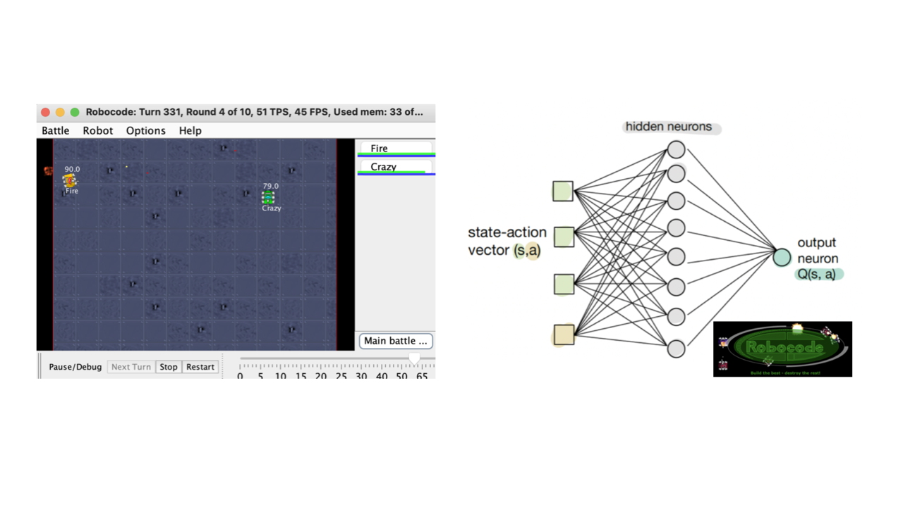

    

## Project Overview
This project was a hands-on exploration of Artificial Intelligence, completed as part of **CPEN 502 - Architecture for Learning Systems**. The primary objective was to develop an intelligent tank, leveraging **Reinforcement Learning (RL)** and **Neural Networks (NNs)**, to autonomously battle against explicitly programmed tanks within a game environment. Through this project, I applied machine learning techniques to design an unsupervised tank that can adapt to its environment and optimize its performance over time.

## Key Features and Learning Outcomes
- **Application of Reinforcement Learning**: Implemented and compared the performance of **Q-Learning** and **SARSA** algorithms, utilizing a multi-layer NN to model the state space and optimize tank actions using **Backpropagation**.
- **Neural Network Design**: Built a neural network with multiple layers to approximate the Q-function, replacing traditional lookup tables. This NN was tuned for optimal performance by experimenting with hyperparameters such as learning rate, momentum, and number of hidden neurons.
- **Performance Metrics**: Assessed the tank's effectiveness by tracking **win rates** and **total rewards** over numerous rounds. Different exploration rates and discount factors were tested to understand their impact on performance and convergence.

## Technical Details
- **Programming Language**: Java
- **Techniques**: Q-Learning, SARSA, Neural Networks with Backpropagation
- **Tools and Libraries**: Custom-built NNs, Robocode simulator for environment interactions

## Project Deliverables
I documented each phase of this project in a series of reports:
1. **Assignment 1** - Set up a basic neural network to solve simple tasks and analyzed the convergence behavior.
2. **Assignment 2** - Developed the intelligent tank, experimenting with on-policy and off-policy learning.
3. **Assignment 3** - Refined the NN-based tank, conducted hyperparameter tuning, and compared performance across different RL algorithms.

These reports provide a comprehensive view of the design choices, implementation challenges, and technical insights gained throughout the project.

---

##### Related material

You can find my project reports for more details on my approach and results:
- [Assignment 1 Report](assignment1.pdf)
- [Assignment 2 Report](assignment2.pdf)
- [Assignment 3 Report](assignment3.pdf)