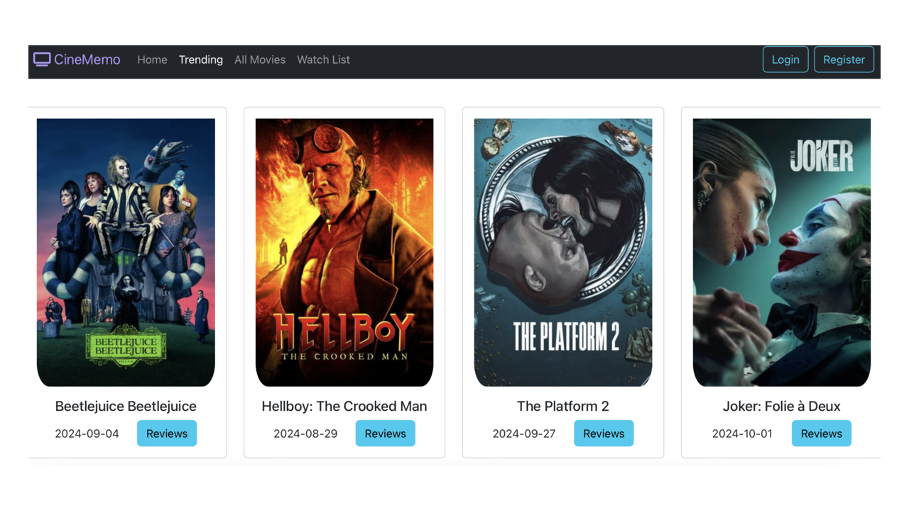

    

### Project Overview
CineMemo is a full-stack web application designed to provide users with a seamless experience for discovering movies, adding films to a personal watch list, and logging reviews for watched movies. The app is built with a responsive and dynamic front-end using React, while the back-end is developed with Spring Boot, allowing for efficient data management and integration with third-party movie APIs.

### Key Features
- **Personalized Movie Watch List and Reviews**: Allows users to save movies to a watch list and log reviews, making it easy to track what they’ve watched and plan future viewings.
- **Responsive Front-End**: Developed with **React** using over 10 reusable components to display real-time movie data from the **TMDB API**. Optimized for smooth, responsive performance across desktop and mobile devices.
- **Scalable Back-End**: Created a **RESTful API** with **Spring Boot** to handle data requests, providing secure and efficient data management and retrieval.
- **Reliable Data Storage**: Utilized **MongoDB** for storing user data, including movie reviews and watch lists, supporting scalability and quick access to information.

### Technical Details
- Integrated the **TMDB API** to fetch real-time movie data, including trending movies and detailed information.
- Built the **RESTful API** in **Spring Boot** to ensure efficient and secure data processing.
- Leveraged **MongoDB** for scalable data management, with a schema designed for reliable storage of user data.
- Developed an interactive UI with **React**, utilizing **JSON** for data transfer, ensuring a smooth user experience.
- Employed **Git** for version control, facilitating organized code management and collaboration.
