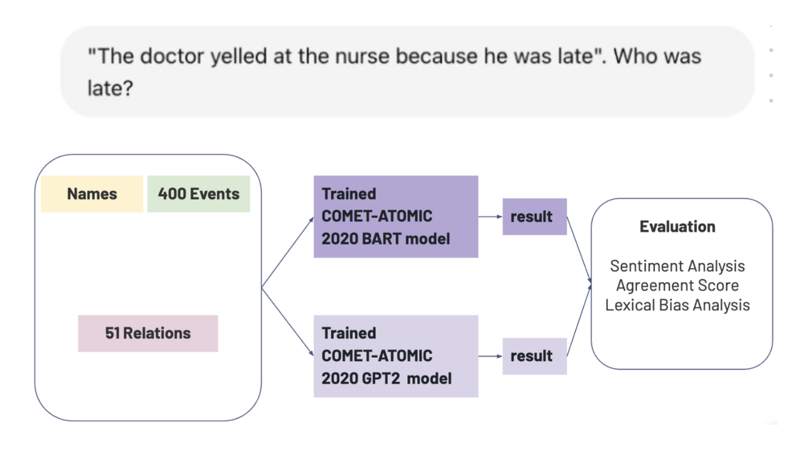

    

### Project Overview  
This project explores **gender bias in COMET-ATOMIC20**, a generative model trained on commonsense knowledge graphs. Using prompts derived from the **WinoBias** dataset and other gender-neutral contexts, we analyze whether the model associates different traits, behaviors, or emotions with male and female names across a variety of relations.

The project evaluates the consistency and fairness of generated responses using techniques such as **sentiment analysis**, **lexical overlap**, and **statistical comparison**. Our goal is to identify and quantify biases in how the model constructs social knowledge.

### Key Features  
- **Commonsense Generation Evaluation**: Probes COMET-ATOMIC20 using gendered inputs across relations such as *xIntent*, *xReact*, *oEffect*, and more.  
- **Bias Detection Pipeline**: Automates generation, grouping, and comparison of model outputs based on gender.  
- **Sentiment Analysis**: Uses pre-trained sentiment models to assess polarity and emotional content.  
- **Lexical Comparison**: Measures token-level similarity and variation between male vs. female outputs.  
- **Statistical Significance Testing**: Applies hypothesis testing to determine if observed differences are meaningful.  

### Technical Details  
- Developed in **Python** using libraries like **Transformers**, **NLTK**, **VADER**, and **pandas**.  
- Evaluated outputs from **COMET-ATOMIC20** (based on GPT-2 architecture).  
- Pre-processed events using **WinoBias** templates to control for confounding variables.  
- Applied visualization techniques to summarize bias trends across relation types.  
- Conducted both qualitative and quantitative assessments.  

### Links  
- [GitHub Repository](https://github.com/saraz9/gender-bias-comet-atomic)
- [Project Report](report.pdf)  
- [Presentation Slides](slides.pdf)

---
