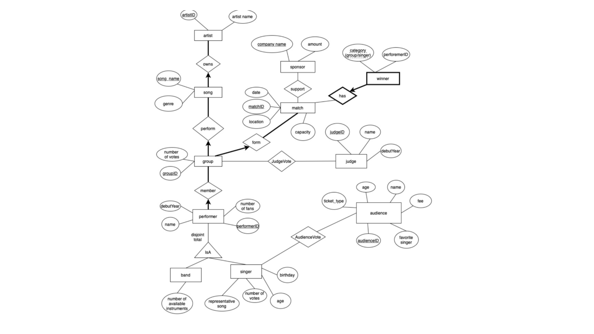

    

## Project Overview
The primary objective is to develop a robust database system to manage a voting process for a performance show featuring singers and bands. The system was designed to handle complex relationships and provide real-time voting results, ensuring a transparent and efficient process for judges and audiences alike.

## Key Features and Learning Outcomes
- **Database Schema Design**: Developed a comprehensive Oracle database schema employing **Boyce-Codd Normal Form (BCNF)** normalization to minimize data redundancy and ensure data integrity.
- **Relationship Management**: Engineered complex relationships within the database to accurately represent interactions between various entities such as performers, judges, and audiences. The schema included more than 10 distinct entity relationships, illustrating the complex nature of data interactions in a live performance setting.
- **Security and Data Integrity**: Implemented robust security measures and data validation processes to protect against unauthorized access and ensure the accuracy of the voting results.

## Technical Details
- **Programming Languages**: JavaScript, SQL
- **Database System**: Oracle
- **Framework**: Node.js for backend development
- **Frontend**: Simplistic GUI using HTML and JavaScript to facilitate user interaction with the database

## Project Deliverables
This project resulted in the creation of a fully functional database application that was utilized during live performance shows to manage voting. Key deliverables included:
1. **Database Schema**: A detailed ER diagram and schema definition, outlining the structure and relationships of the database.
2. **Backend Implementation**: A set of backend services built with JavaScript and Node.js, handling database interactions and ensuring smooth operation during live events.
3. **Frontend Interface**: A user-friendly GUI that allowed judges and audiences to interact seamlessly with the system during performances.

---

##### Related material

+ Full report (available upon request)
+ Code (available upon request)