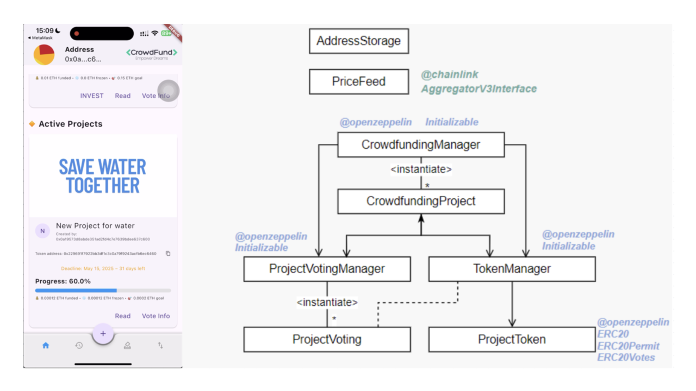

    

### Project Overview  
**BlockCrafters** is a decentralized crowdfunding platform designed to address the limitations of traditional startup fundraising. Built on the Ethereum blockchain with a Flutter frontend, the platform allows startups to raise funds through project-specific ERC20 tokens that also serve as governance tools. Funds are released based on milestone progress and investor voting, ensuring transparency, accountability, and community trust.

### Key Features  
- **Tokenized Fundraising**: Each project issues a unique ERC20 token to represent ownership and enable milestone voting.  
- **Milestone-Based Fund Release**: Funds are held in smart contract escrow and only released upon reaching pre-set goals.  
- **Investor Governance**: Token holders vote on key project decisions, including milestone approval and deadline extensions.  
- **Cross-Platform Frontend**: Built with **Flutter**, the app supports both web and mobile users.  
- **Decentralized File Storage**: Leveraged **IPFS** for storing project metadata such as descriptions, images, and social links.  
- **Upgradeable Contracts**: Smart contract architecture supports future extensibility via OpenZeppelin’s upgradeable proxies.  

### Technical Details  
- **Smart Contracts** written in **Solidity**, handling project creation, milestone management, fund distribution, refunds, and governance.  
- **Frontend** developed with **Flutter**, integrating WalletConnect for Ethereum wallet access.  
- **File handling** powered by **IPFS** (via Pinata), used to store project descriptions and media in a decentralized way.  
- **State management** via Bloc pattern, supporting asynchronous interaction with the blockchain.  
- **WalletConnect** enables users to authenticate, invest, and vote using MetaMask or other EVM-compatible wallets.  
- **Unit Testing** conducted with **Hardhat** and **Chai** to ensure the integrity and security of core contract functionalities.  

### Links  
- [GitHub Repository](https://github.com/saraz9/blockcrafters-dapp)
- [Project Report](report.pdf)
- [Slide Deck](slides.pdf)
---